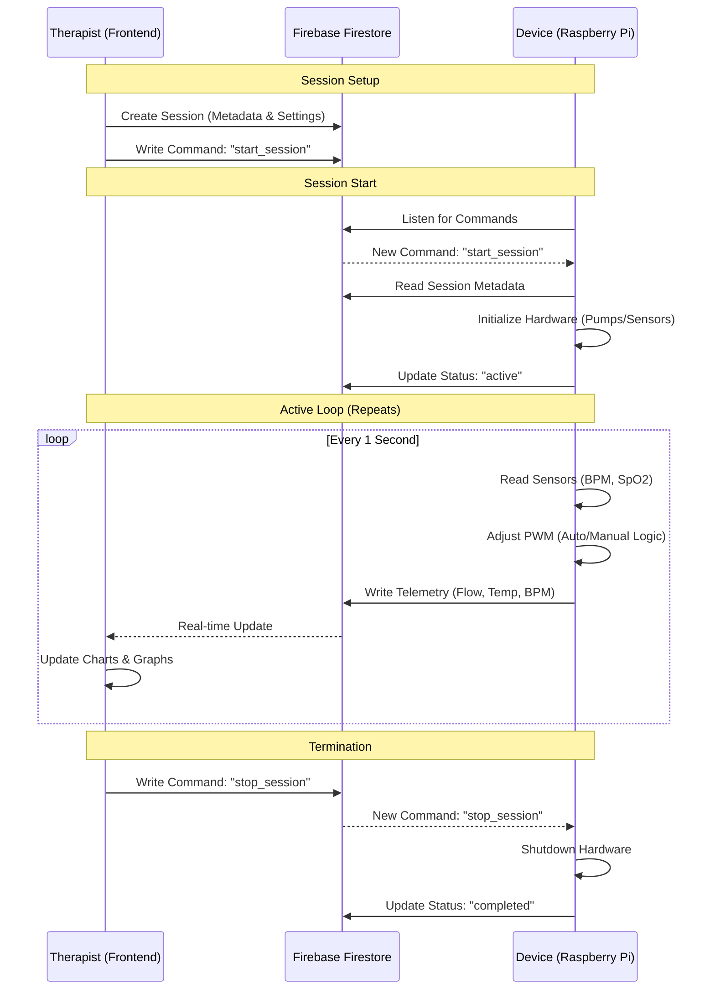
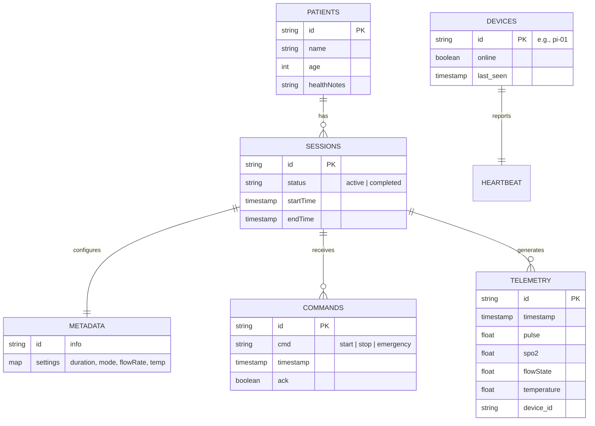

# Shirodhara Project Workflow & Architecture

## 1. Project Overview
The **Shirodhara Smart Monitoring System** is an IoT-enabled therapeutic device controller and monitoring platform. It allows therapists to manage patient sessions, control hardware (flow rate, temperature) remotely, and monitor real-time patient biometrics (Pulse, SpO2) during Shirodhara treatments.

## 2. System Architecture
The system consists of three main components interacting via **Firebase Firestore**:

1.  **Frontend (React Web App)**:
    *   **Role**: User Interface for therapists.
    *   **Features**: Patient management, session booking, real-time monitoring dashboard, remote control (Start/Stop/Emergency).
    *   **Hosting**: Served via Node.js (static) or Vite dev server.

2.  **Backend / Database (Firebase Firestore)**:
    *   **Role**: Central nervous system. Acts as the message broker and persistent storage.
    *   **Function**: Stores patient data, session history, and real-time telemetry. Syncs commands between Frontend and Device.

3.  **Device Controller (Python on Raspberry Pi)**:
    *   **Role**: Hardware interface.
    *   **Features**: Controls pumps/heaters (via GPIO/PWM), reads sensors (MAX30102 for BPM), executes "Auto Mode" logic.
    *   **Logic**: Listens for Firestore commands and pushes telemetry.

## 3. Detailed Workflow

### Phase 1: Session Setup
1.  **Therapist Login**: User logs into the web application.
2.  **Patient Selection**: Therapist selects a patient from the dashboard or registers a new one.
3.  **Booking/Configuration**: Therapist sets up a session:
    *   **Mode**: Manual (fixed flow/temp) or Auto (dynamic curve based on BPM).
    *   **Duration**: Session length (e.g., 45 mins).
    *   **Parameters**: Target Flow Rate (ml/min) and Temperature (°C).

### Phase 2: Session Initiation
1.  **Start Command**: Therapist clicks "Start Session" on the dashboard.
2.  **Command Dispatch**: Frontend creates a `start_session` command in Firestore (`patients/{pid}/sessions/{sid}/commands`).
3.  **Device Activation**:
    *   The Python script (`shirodhara_device.py`) detects the new command.
    *   It fetches session metadata (settings) from Firestore.
    *   It initializes hardware (PWM for pumps/heaters, Sensors).
    *   It updates the session status to `active`.

### Phase 3: Active Treatment (The Loop)
The device enters a main loop running every few seconds:

1.  **Sensing**: Reads Pulse (BPM) and SpO2 from the MAX30102 sensor.
2.  **Auto Mode Logic** (if enabled):
    *   Calculates elapsed time.
    *   Adjusts Flow Rate and Temperature targets based on a therapeutic curve and current BPM (bio-feedback).
3.  **Actuation**: Updates GPIO PWM duty cycles to match target Flow/Temp.
4.  **Telemetry**: Uploads a data packet to Firestore (`.../telemetry`):
    *   `timestamp`, `pulse`, `spo2`, `flowState`, `temperature`.
5.  **Monitoring**:
    *   Frontend listens to the `telemetry` collection.
    *   Updates live charts (Flow vs Temp, BPM) and status indicators (Relaxation Score) on the `SessionMonitor` page.

### Phase 4: Termination
The session ends in one of three ways:
1.  **Timer Expiry**: Device detects `elapsed_time >= duration`.
2.  **Manual Stop**: Therapist clicks "Stop". Frontend sends `stop_session` command.
3.  **Emergency Stop**: Therapist clicks "Emergency Stop". Frontend sends `emergency_stop` command. Device immediately cuts power to all actuators.

Upon termination, the device turns off all hardware and updates the session status to `completed` or `stopped`.

---

## 4. Flowcharts

### System Interaction Flow


### Device Logic (Python Service)
```mermaid
flowchart TD
    Start[Start Service] --> Init[Init Firebase & GPIO]
    Init --> Listen{Listen for Commands}
    
    Listen -- "start_session" --> GetMeta[Fetch Session Settings]
    GetMeta --> HWStart[Start Hardware & Sensors]
    HWStart --> Loop[Main Control Loop]
    
    Loop --> ReadSensors[Read MAX30102 (BPM)]
    ReadSensors --> CheckMode{Mode?}
    
    CheckMode -- Auto --> CalcCurve[Calculate Target Flow/Temp (Curve + BPM)]
    CheckMode -- Manual --> KeepSettings[Keep User Settings]
    
    CalcCurve --> Actuate[Update PWM Outputs]
    KeepSettings --> Actuate
    
    Actuate --> Telemetry[Upload Telemetry to Firestore]
    Telemetry --> CheckStop{Stop Condition?}
    
    CheckStop -- Timer/Command --> Stop[Stop Hardware]
    CheckStop -- Continue --> Loop
    
    Stop --> Listen
```

---

## 5. Entity Relationship Diagram (Firestore)

The database is NoSQL (Firestore), structured as a hierarchy of collections.


